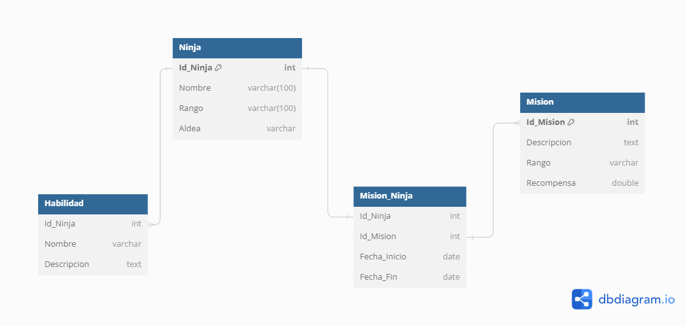
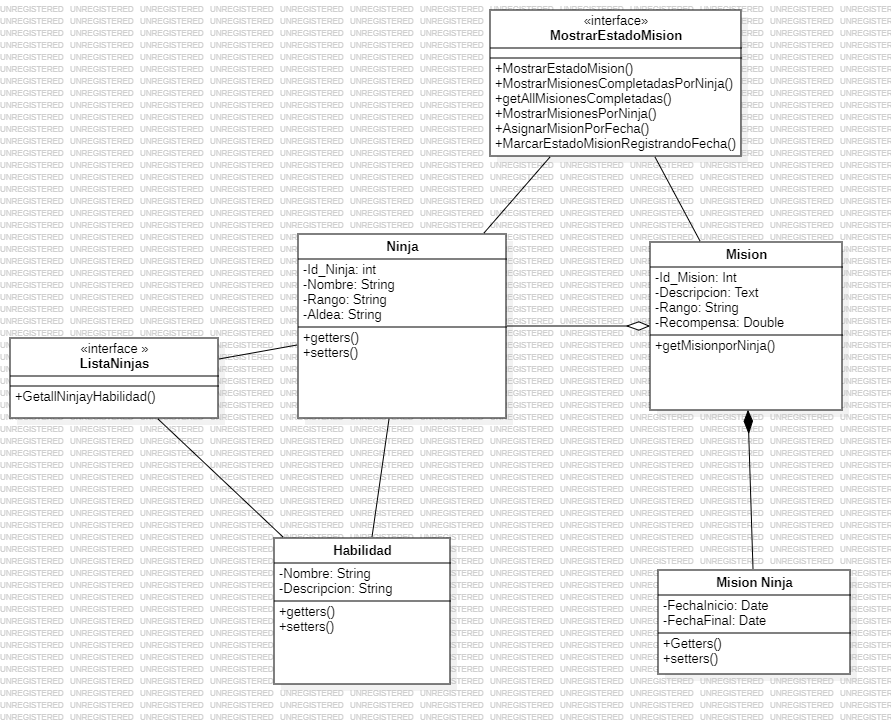

# EXAMEN FILTRO JAVA 

En el presente repositorio creamos un software supliendo la necesidad de la aldea de modernizar el sistema de gestion de datos de sus ninjas, a continuacion se presentara la informacion pertinente para el desarrollo de dicho aplicativo. 

## Que contiene el repositorio. 

BASE DE DATOS BD.SQL e INSERTS 

CABE RECALCAR QUE SE BORRO UNA FOREIGN KEY PORQUE BOTABA ERROR A LA HORA DE CREAR UN NUEVO USUARIO UTILIZAR EL BD EN ESTE REPOSITORIO 

* CLASES 

# BASE DE DATOS 

# Diagrama de clases 

Creacion de las bases de datos 
`  DROP DATABASE IF EXISTS Naruto_KevinEsteban; 

  CREATE DATABASE  Naruto_KevinEsteban;

  USE Naruto_KevinEsteban;

  CREATE TABLE Ninja (
    Id_Ninja int ,
    Nombre varchar(100),
    Rango varchar(100),
    Aldea varchar(255)
  );

  CREATE TABLE Mision (
    Id_Mision int ,
    Descripcion text,
    Rango varchar(255),
    Recompensa double
  );

  CREATE TABLE Mision_Ninja (
    Id_Ninja int,
    Id_Mision int,
    Fecha_Inicio date,
    Fecha_Fin date,
    Estado boolean
  );

  CREATE TABLE Habilidad (
    Id_Ninja int,
    Nombre varchar(255),
    Descripcion text
  );

  -- Llaves Primarias 

  ALTER TABLE Ninja ADD CONSTRAINT PK_IDNinja PRIMARY KEY (Id_Ninja); 

  ALTER TABLE Mision ADD CONSTRAINT PK_IDMision PRIMARY KEY (Id_Mision); 
  -- Index 

  CREATE INDEX idx_id_ninja ON Ninja (Id_Ninja);
  CREATE INDEX idx_id_mision ON Mision_Ninja(Id_Mision); 
  CREATE INDEX idx_id_ninja ON Mision_Ninja (Id_Ninja);
  CREATE INDEX idx_id_mision ON Mision(Id_Mision); 

  -- Llaves Foraneas 

  ALTER TABLE Habilidad ADD FOREIGN KEY (Id_Ninja) REFERENCES Ninja (Id_Ninja);

  ALTER TABLE Mision ADD FOREIGN KEY (Id_Mision) REFERENCES Mision_Ninja (Id_Mision);

`

Inserts alojados en la carpeta sql 

